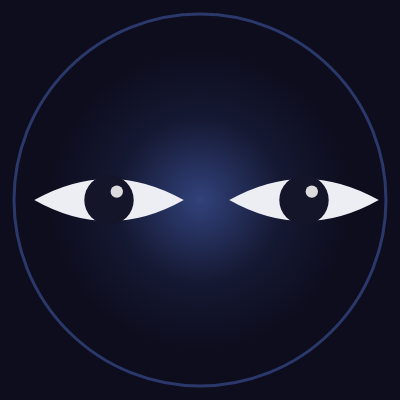

  

<h1 align="center">Eyes</h1>

  <b>An autonomous Windows desktop agent that knows when it failed.</b> 
  Showcase repository — the source is proprietary and not published here.

  <b><a href="https://marcarregui-bit.github.io/eyes-showcase/">marcarregui-bit.github.io/eyes-showcase</a></b>

  <a href="#what-it-does-today">What it does</a> ·
  <a href="#the-difference">The difference</a> ·
  <a href="#what-it-does-not-do">What it does <i>not</i> do</a> ·
  <a href="#partnership">Partnership</a>

---

Desktop AI agents don't fail at clicking. They fail at not noticing.

On the public desktop benchmark for computer-use agents (OSWorld) the state of the art
sits near **20 %** success against a **72 %** human baseline, and the problem the
literature keeps naming is not dexterity — it is that agents don't recognise their own
failures and cascade errors from there.

**Eyes** verifies the effect of every action against the world, keeps a register of what
it has actually demonstrated *per application*, and refuses to claim the rest.

| | |
|---:|:---|
| **7,227** | tests passing |
| **0** | tests failing |
| **367** | test files |
| **212** | modules |
| **52** | closure checks (static, 35 s) |
| **3 months** | one person, 312 commits |

Measured on 25 · 08 · 2026 on the machine Eyes was built on. Not extrapolated.

---

## What it does today

Not a roadmap. Every item is exercised by the test suite and demonstrable live.

- **It drives Windows, not an API.** Opens apps, types, clicks, navigates, reads the
  screen. Word, Excel, PowerPoint and Outlook through COM; LibreOffice through UNO when
  Office isn't there; the browser through CDP. No RPA recorder, no brittle coordinates.
- **Every action is checked against the world.** A universal oracle reads the effect —
  object state first, then the UI tree, then pixels — and a step is only closed when the
  effect is confirmed. A sentence is not evidence; a file on disk is.
- **It produces documents, not summaries.** A drafter with a data contract, a judge that
  can send it back, and a verified PDF on disk. If the composer can't run, it says so and
  delivers the result another way instead of declaring the job done.
- **Big spreadsheets, answered locally.** A local columnar store ingests whole workbooks —
  millions of rows — and answers in place. The data never leaves the machine; only a
  pseudonymised schema does.
- **What crosses the wire is written down.** Pseudonymisation with an ephemeral in-RAM key,
  an allowlist on generated SQL, no disk or network reachable from a query, exfiltration
  verbs classified and confirmed. Voice is local by default.
- **It learns this machine, not the internet.** A local index of your paths and a click
  memory of what worked where, so the second time is faster than the first.
- **Stoppable, and honest about it.** Pause, resume and stop at any point. A halted batch
  reports how many actions ran. Destructive keys are blocked when it can't verify what is
  in front — including its own window and your terminal.
- **Missing capability is announced, not hidden.** A pre-flight check at startup states
  what this machine can actually deliver today. Silence about a missing capability is the
  failure mode Eyes was built to avoid.

## The difference

Eyes keeps a capability register, and the register can say no.

| capability | application | evidence | verdict |
|---|---|---|---|
| `press_key : sheet count +1` | excel.exe | 5/5 | **proven** |
| `Font.Bold via COM` | winword.exe | 5/5 | **proven** |
| `Cursor.MoveTo via UNO` | libreoffice | 0/3 | **disproven** |
| `play track by URI` | spotify.exe | 2/3 | **unstable** |

A capability with a single success is flagged as untested ground, not as a skill. A
capability the user vetoed stays vetoed even if the oracle later succeeds. When Eyes is
asked what it can do, this is what it reads from — and it will tell you what it cannot.

## What it does not do

A product whose whole thesis is not overclaiming has to say this out loud.

- **Windows 10/11 only.** No macOS, no Linux. It talks to Win32, COM and UI Automation.
- **Spanish interface.** The agent thinks in Spanish today. Not a hard constraint, but it
  is the truth right now.
- **No installer yet.** It runs from its own folder, and it has never been installed on a
  second machine — until it is, we don't claim it works there.
- **No production customers.** Three months old, one person, zero paying users. The tests
  are real; the traction isn't there yet.
- **The source is not public.** This repository is a showcase; the code stays private.

## Partnership

Eyes is not for sale as a download. We are looking for a partner — an integrator, a
platform, or an industrial software vendor — with a real desktop-automation problem and
users to point it at. Pilots, licensing, an acquisition of the IP together with the
person who built it — all of it is on the table. Tell me which of those you are thinking
about and I will answer in the same terms.

**[marc.arregui@gmail.com](mailto:marc.arregui@gmail.com?subject=Eyes%20—%20partnership)**

---

Eyes — autonomous Windows desktop agent. © 2026 Marc Arregui. All rights reserved.
No licence is granted by this repository: the name, the design and the source code remain
the property of the author.
